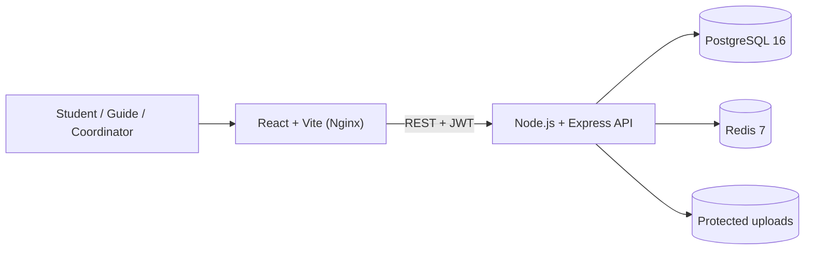
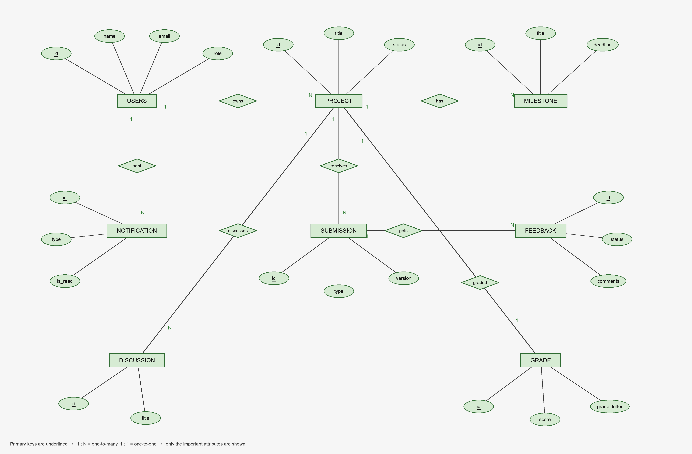
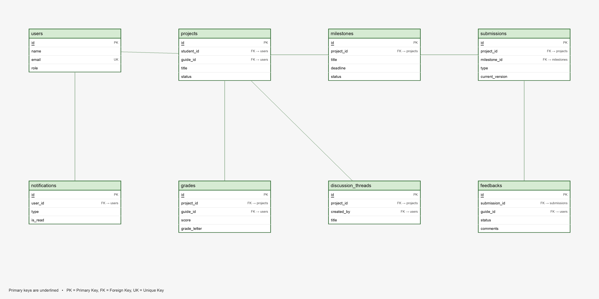

<!-- markdownlint-disable MD001 MD013 MD024 MD033 MD036 MD041 -->

# ProjectTrack

Academic project governance platform for **Students, Guides and Coordinators** — proposals, guide assignment, milestones, versioned submissions, feedback, discussions, grading and analytics.

[](https://github.com/pokemon-uc/ProjectTrack/actions/workflows/ci.yml)
[](https://github.com/pokemon-uc/ProjectTrack/actions/workflows/security.yml)

**Live demo (Azure VM):** <http://52.140.125.71:5173> — works only while the portfolio VM is running.

## Tech Stack

**React** · **Node.js + Express** · **PostgreSQL 16** · **Redis 7** · **Docker Compose** · **Nginx** · **JWT + bcrypt** · **Swagger/OpenAPI** · **GitHub Actions CI/CD** · **Azure VM**

## Features

- **Student** — create projects, submit for review, upload PDF/DOC/DOCX, keep every version, join discussions, view feedback and grades
- **Guide** — see assigned projects, set milestones, review submission versions, approve / reject / request revision
- **Coordinator** — assign guides, record final grades, view institution-wide analytics and audit history
- **Security** — JWT auth, bcrypt (12 rounds), role-based access, ownership checks (IDOR safe), Redis rate limiting, Helmet + CORS allowlist, protected file downloads

## Screenshots

| Login (live Azure URL)                       | Student Dashboard                                          |
| -------------------------------------------- | ---------------------------------------------------------- |
|  |  |

| Guide Dashboard                                        | Coordinator Analytics                                            |
| ------------------------------------------------------ | ---------------------------------------------------------------- |
|  |  |

## System Architecture



## ER Diagram



## Relational Schema



11 normalized tables with primary keys, foreign keys, `UNIQUE` and `CHECK` constraints. Full definitions in [`backend/database/init.sql`](backend/database/init.sql).

## Why PostgreSQL and not MongoDB?

The data is strongly relational — a student owns projects, projects contain milestones, submissions and grades, and submissions keep versions. PostgreSQL gives foreign keys, transactions, `CHECK`/`UNIQUE` constraints and SQL joins for the dashboards. MongoDB would push all of that consistency logic into the application.

## Quick Start

```bash
git clone https://github.com/pokemon-uc/ProjectTrack.git
cd ProjectTrack
cp .env.docker.example .env      # then set DB_PASSWORD and JWT_SECRET
docker compose up --build -d
```

- Frontend — `http://localhost:5173`
- API health — `http://localhost:5000/api/health`
- Swagger UI — `http://localhost:5000/api/docs`

Stop with `docker compose down`.

## Main API Endpoints

| Method | Endpoint                         | Role        |
| ------ | -------------------------------- | ----------- |
| POST   | `/api/auth/register`             | Public      |
| POST   | `/api/auth/login`                | Public      |
| POST   | `/api/projects`                  | Student     |
| POST   | `/api/projects/:id/submissions`  | Student     |
| PUT    | `/api/projects/:id/assign-guide` | Coordinator |
| POST   | `/api/submissions/:id/feedback`  | Guide       |
| POST   | `/api/projects/:id/grade`        | Coordinator |
| GET    | `/api/analytics/dashboard`       | Coordinator |

Full contract: [`backend/docs/openapi.yaml`](backend/docs/openapi.yaml)

## CI/CD

GitHub Actions runs ESLint, production builds, OpenAPI validation and a Docker Compose smoke test on every push, plus CodeQL, npm audit and Trivy scans. Deployment to the Azure VM is gated over SSH — see [`CI-CD-AZURE-SETUP.md`](CI-CD-AZURE-SETUP.md).

## Author

**Prisha Kulkarni** — [github.com/pokemon-uc](https://github.com/pokemon-uc)
