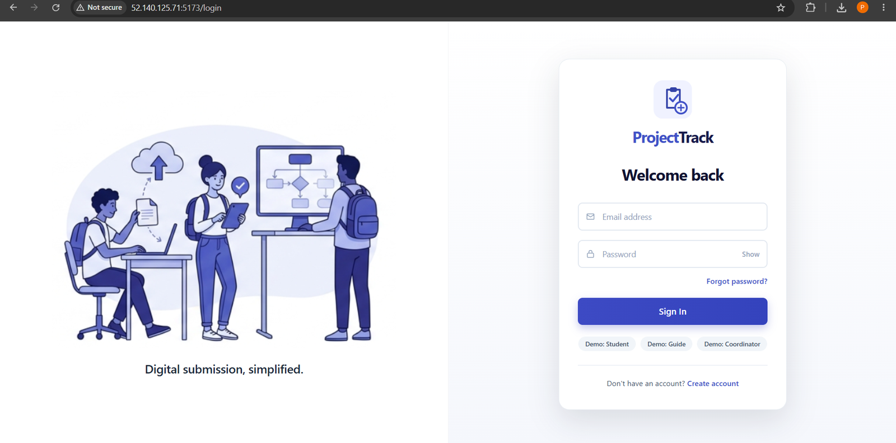
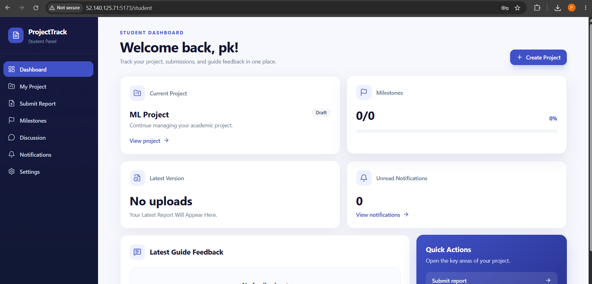
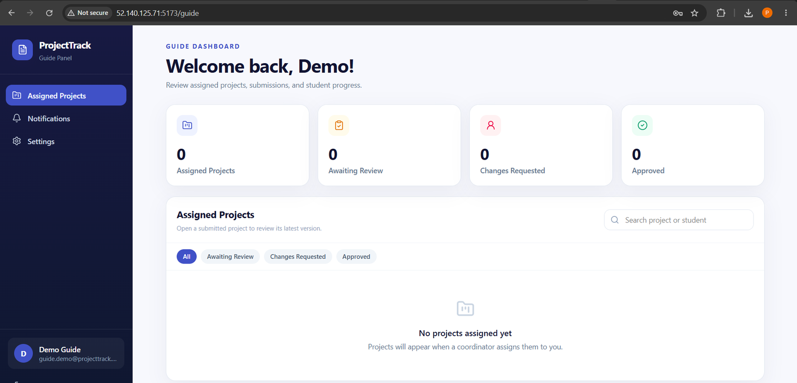
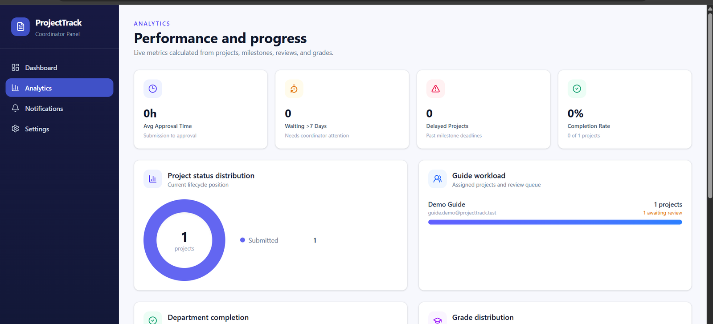
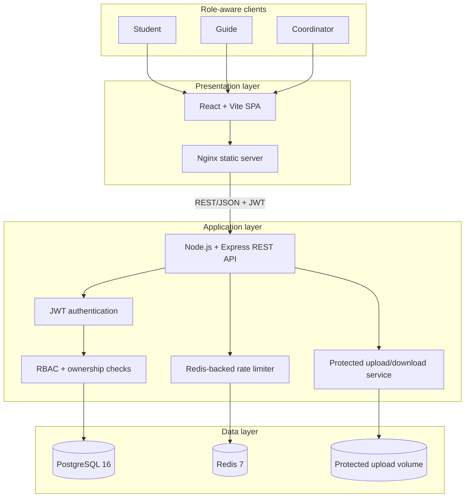
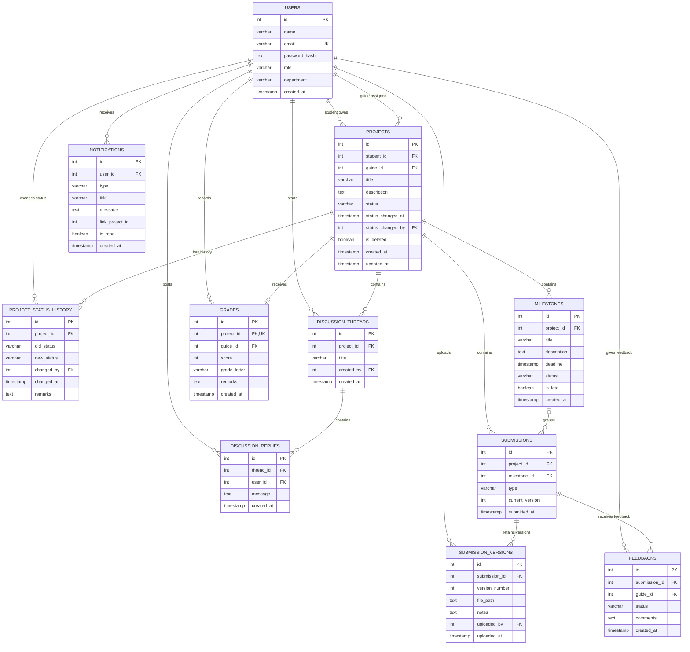
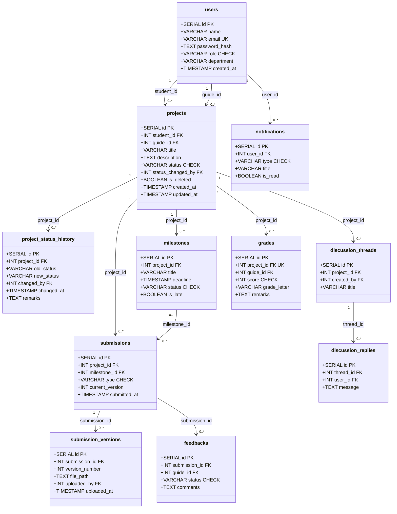

<!-- markdownlint-disable MD001 MD013 MD024 MD033 MD041 -->

<div align="center">

# ProjectTrack

### Security-focused academic project governance platform

[](https://github.com/pokemon-uc/ProjectTrack/actions/workflows/ci.yml)
[](https://github.com/pokemon-uc/ProjectTrack/actions/workflows/security.yml)


ProjectTrack coordinates the complete academic project workflow across **Students, Guides, and Coordinators**—from proposal and guide assignment to milestones, versioned submissions, structured feedback, discussions, grading, notifications, audit history, and analytics.

[Features](#core-capabilities) · [Screenshots](#application-screenshots) · [Architecture](#system-architecture) · [ER Diagram](#entity-relationship-diagram) · [Schema](#relational-schema-diagram) · [Setup](#quick-start-with-docker-compose)

</div>

---

## Overview

Academic projects are often managed through disconnected spreadsheets, email threads, chat messages, and unstructured file sharing. This makes ownership, deadlines, review history, feedback, submission versions, and final grading difficult to track.

ProjectTrack replaces that fragmented process with one role-aware governance workflow:

```text
Student creates and submits a project
                ↓
Coordinator assigns a Guide
                ↓
Guide/Coordinator define and review milestones
                ↓
Student uploads versioned submissions
                ↓
Guide provides structured feedback
                ↓
Coordinator records the final grade
                ↓
Dashboards, notifications, and audit history remain available
```

This is a portfolio deployment demonstrating production-oriented design and delivery. It is not presented as an institutionally adopted production system.

## Core Capabilities

### Student

- Register through the public Student-only registration flow
- Create and manage owned projects
- Submit projects for institutional review
- Track milestones and project completion
- Upload PDF, DOC, and DOCX documents
- Retain every submission version instead of overwriting files
- Participate in project discussion threads
- View feedback, grades, audit history, and workflow notifications

### Guide

- View only assigned projects
- Create and review milestones
- Inspect submission versions
- Approve, reject, or request revision through structured feedback
- Participate in project discussions
- Track assigned-project progress

### Coordinator

- View institution-wide project data
- Assign Guides to projects
- Create and review milestones
- Record final project grades
- Monitor status, departments, delays, and aggregate metrics
- Access project audit history and coordinator analytics

## Application Screenshots

Four representative screenshots keep the README focused while proving that the main role-based workflows are implemented. The temporary public Azure URL is intentionally visible in the login screenshot; it may be unavailable while the portfolio VM is deallocated.

| Public deployment and authentication                             | Student dashboard                                                                 |
| ---------------------------------------------------------------- | --------------------------------------------------------------------------------- |
|  |  |

| Guide dashboard                                                               | Coordinator analytics                                                                     |
| ----------------------------------------------------------------------------- | ----------------------------------------------------------------------------------------- |
|  |  |

## Security Highlights

- JWT authentication with configurable expiration
- bcrypt password hashing with 12 salt rounds
- Role-based authorization for Student, Guide, and Coordinator actions
- Ownership and assignment checks that mitigate IDOR attacks
- Student-only public registration; privileged accounts are institution-managed
- Redis-backed rate limiting for authentication endpoints
- Strict CORS allowlist and Helmet security headers
- Protected download endpoints instead of public upload URLs
- UUID-based uploaded filenames
- PDF, DOC, and DOCX allowlist with a 10 MB limit
- Environment-based secrets; real `.env` files are excluded from Git
- Graceful HTTP, Redis, and PostgreSQL shutdown handling

## System Architecture



## Entity-Relationship Diagram

This conceptual ER diagram shows the business relationships between the 11 normalized entities.



## Relational Schema Diagram

The schema diagram below focuses on implementation-level primary keys, foreign keys, unique values, and important constrained columns.



## Why PostgreSQL Instead of MongoDB/NoSQL?

ProjectTrack could be implemented with MongoDB, but PostgreSQL is the more natural choice for this domain.

The data is highly relational:

- A Student owns Projects.
- A Coordinator assigns a Guide.
- Projects contain Milestones, Submissions, Discussions, Grades, and status history.
- Submissions retain multiple versions.
- Feedback belongs to both a Submission and a Guide.

| Requirement                    | Why PostgreSQL fits                                                                                   |
| ------------------------------ | ----------------------------------------------------------------------------------------------------- |
| Relationship integrity         | Foreign keys prevent orphaned Projects, Submissions, Feedback, and Replies.                           |
| Multi-step workflows           | Transactions support consistent assignment, submission, review, and grading changes.                  |
| Valid domain values            | `CHECK`, `UNIQUE`, range, and not-null constraints reject invalid records at the database layer.      |
| Dashboards and analytics       | SQL joins and aggregations naturally support Guide, Coordinator, department, status, and grade views. |
| Auditability                   | Normalized status history and submission-version tables preserve a reliable record of change.         |
| Predictable institutional data | A stable relational schema is preferable to loosely structured documents for governance records.      |

MongoDB would still be a valid choice if the main requirement were rapidly changing document structures, independent aggregate records, or denormalized high-volume access patterns. For ProjectTrack, **consistency, relationships, auditability, and analytical queries are more important than schema flexibility**.

### Interview Answer

> ProjectTrack has strongly related data: Students own Projects, Coordinators assign Guides, Projects contain Milestones and Submissions, and Submissions retain Versions and Feedback. PostgreSQL gives me foreign keys, transactions, constraints, joins, and aggregations that preserve those relationships and simplify role dashboards and analytics. MongoDB could work, but it would require more application-level consistency management or duplicated data. Because this system prioritizes integrity and auditability over flexible document schemas, PostgreSQL was the better fit.

## Technology Stack

| Area                | Technology                                                     |
| ------------------- | -------------------------------------------------------------- |
| Frontend            | React, Vite, React Router, Axios, Tailwind CSS                 |
| Backend             | Node.js 20+, Express 5                                         |
| Database            | PostgreSQL 16                                                  |
| Cache/rate limiting | Redis 7                                                        |
| Authentication      | JWT, bcryptjs                                                  |
| Uploads             | Multer with protected download endpoints                       |
| API documentation   | OpenAPI 3, Swagger UI                                          |
| Containers          | Docker, Docker Compose, Nginx                                  |
| CI                  | GitHub Actions, ESLint, production builds, Compose smoke tests |
| Security automation | CodeQL, npm audit, Trivy filesystem and image scans            |
| Cloud deployment    | Ubuntu Azure VM with SSH-based gated deployment                |

## Project Structure

```text
ProjectTrack/
├── .github/workflows/
│   ├── ci.yml
│   ├── security.yml
│   └── deploy-azure-vm.yml
├── backend/
│   ├── config/
│   ├── controllers/
│   ├── database/init.sql
│   ├── docs/openapi.yaml
│   ├── middleware/
│   ├── models/
│   ├── routes/
│   ├── uploads/
│   └── server.js
├── frontend/
│   ├── src/
│   ├── Dockerfile
│   └── nginx.conf
├── docs/images/
├── docker-compose.yml
├── .env.docker.example
├── CI-CD-AZURE-SETUP.md
└── README.md
```

## Quick Start With Docker Compose

### Prerequisites

- Git
- Docker Desktop or Docker Engine with the Compose plugin

### 1. Clone the repository

```bash
git clone https://github.com/pokemon-uc/ProjectTrack.git
cd ProjectTrack
```

### 2. Create the root environment file

Linux/macOS:

```bash
cp .env.docker.example .env
```

Windows PowerShell:

```powershell
Copy-Item .env.docker.example .env
```

Generate strong secrets locally:

```bash
node -e "console.log(require('crypto').randomBytes(32).toString('hex'))"
node -e "console.log(require('crypto').randomBytes(64).toString('hex'))"
```

Set these root variables:

```env
DB_USER=postgres
DB_NAME=projecttrack
DB_PASSWORD=<strong-generated-database-password>
JWT_SECRET=<strong-generated-jwt-secret>
JWT_EXPIRES_IN=2h
CLIENT_URL=http://localhost,http://localhost:5173,http://localhost:5000
VITE_API_URL=http://localhost:5000/api
```

Never commit `.env` files or reuse demonstration credentials in a real environment.

### 3. Build and start the stack

```bash
docker compose up --build -d
```

### 4. Verify service health

```bash
docker compose ps
```

Open:

- Frontend: `http://localhost:5173`
- Backend health: `http://localhost:5000/api/health`
- Swagger UI: `http://localhost:5000/api/docs`
- OpenAPI JSON: `http://localhost:5000/api/openapi.json`

### 5. Stop the stack

```bash
docker compose down
```

The named volumes remain. Running `docker compose down -v` also deletes local PostgreSQL, Redis, and upload data.

## API Overview

| Method | Endpoint                                       | Authorization                    | Purpose                        |
| ------ | ---------------------------------------------- | -------------------------------- | ------------------------------ |
| POST   | `/api/auth/register`                           | Public                           | Register a Student account     |
| POST   | `/api/auth/login`                              | Public                           | Authenticate and receive a JWT |
| GET    | `/api/auth/me`                                 | Authenticated                    | Load the current user          |
| POST   | `/api/projects`                                | Student                          | Create a project               |
| GET    | `/api/projects/mine`                           | Student                          | List owned projects            |
| GET    | `/api/projects/assigned`                       | Guide                            | List assigned projects         |
| GET    | `/api/projects/all`                            | Coordinator                      | List all projects              |
| PUT    | `/api/projects/:id/assign-guide`               | Coordinator                      | Assign a Guide                 |
| POST   | `/api/projects/:id/milestones`                 | Guide/Coordinator                | Create a milestone             |
| POST   | `/api/projects/:id/submissions`                | Student                          | Upload a submission version    |
| GET    | `/api/submission-versions/:versionId/download` | Authenticated + ownership checks | Download a protected file      |
| POST   | `/api/submissions/:subId/feedback`             | Guide                            | Record structured feedback     |
| POST   | `/api/projects/:id/grade`                      | Coordinator                      | Record the final grade         |
| GET    | `/api/analytics/dashboard`                     | Coordinator                      | Load aggregate analytics       |

The complete API contract is available in [`backend/docs/openapi.yaml`](backend/docs/openapi.yaml).

## CI, Security, and Deployment

### Continuous Integration

Every push and pull request to `main` runs:

- Backend dependency installation and JavaScript syntax checks
- OpenAPI YAML validation
- Frontend dependency installation, ESLint, and production build
- Full Docker Compose build and smoke test
- Backend and frontend health checks

### Security Automation

The security workflow runs on pushes, pull requests, manual dispatch, and a weekly schedule:

- CodeQL analysis for JavaScript/TypeScript
- Production dependency audits
- Trivy repository scanning
- Trivy backend/frontend container-image scanning
- SARIF uploads to GitHub code scanning

Trivy currently reports HIGH and CRITICAL findings without failing the pipeline, allowing findings to be reviewed before enforcement is enabled.

### Azure Deployment

The Docker Compose stack was validated on an Ubuntu Azure VM. The gated deployment workflow connects over SSH, updates `/opt/projecttrack`, rebuilds containers, verifies backend/frontend health, and prunes unused images.

Automatic deployment runs after successful CI only when the GitHub production environment is configured and `AZURE_DEPLOY_ENABLED=true`.

See [`CI-CD-AZURE-SETUP.md`](CI-CD-AZURE-SETUP.md) for setup details.

## Deployment Scope and Future Improvements

The Azure VM is a portfolio environment and may be deallocated outside demonstration windows to preserve student credits. A real institutional rollout would additionally require:

- HTTPS with a trusted domain and reverse proxy
- Secure email-based password recovery with expiring single-use tokens
- Managed PostgreSQL and Redis
- Azure Blob Storage for submitted documents
- Key Vault for production secrets
- Automated unit, integration, authorization, and end-to-end tests
- Monitoring, alerts, backups, and disaster recovery
- Multiple application replicas behind a load balancer
- Optional two-factor authentication

## Author

Prisha Kulkarni

- GitHub: [pokemon-uc](https://github.com/pokemon-uc)

Built to demonstrate full-stack engineering, relational data modeling, API security, Dockerized delivery, automated quality checks, and cloud deployment.
