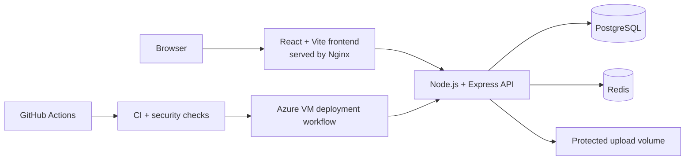

<!-- markdownlint-disable MD013 -->

# ProjectTrack — Academic Project Governance Platform

[](https://github.com/pokemon-uc/ProjectTrack/actions/workflows/ci.yml)
[](https://github.com/pokemon-uc/ProjectTrack/actions/workflows/security.yml)


ProjectTrack is a security-focused **PERN** application for governing academic projects across Students, Guides, and Coordinators. It centralizes project proposals, guide assignment, milestones, versioned submissions, feedback, discussions, grading, notifications, audit history, and coordinator analytics.

The project is designed as a portfolio-ready implementation of a real institutional workflow—not as a simple version tracker.

## What Problem Does It Solve?

Academic projects are often managed through disconnected spreadsheets, email threads, chat messages, and unstructured file sharing. This makes ownership, review history, deadlines, feedback, and final grading difficult to track.

ProjectTrack provides one role-aware workflow:

```text
Student creates and submits a project
                ↓
Coordinator assigns a Guide
                ↓
Guide/Coordinator define and review milestones
                ↓
Student uploads versioned submissions
                ↓
Guide provides structured feedback
                ↓
Coordinator records the final grade
                ↓
Dashboards, notifications, and audit history remain available
```

## Role-Based Capabilities

### Student

- Register through the public registration flow
- Create and manage owned projects
- Submit projects for institutional review
- Track assigned milestones and completion
- Upload PDF, DOC, and DOCX submissions
- Retain submission history across multiple versions
- Participate in project discussion threads
- View feedback, grades, and workflow notifications

### Guide

- View only assigned projects
- Create and review project milestones
- Review submission versions
- Approve, reject, or request revisions through structured feedback
- Participate in project discussions

### Coordinator

- View institution-wide project data
- Assign Guides to projects
- Create and review milestones
- Record final project grades
- Monitor project status, delays, departments, and aggregate metrics
- Access coordinator analytics

## Security Highlights

- JWT authentication with configurable expiration
- bcrypt password hashing with 12 salt rounds
- Role-based authorization for Student, Guide, and Coordinator actions
- Ownership and assignment checks to mitigate IDOR attacks
- Student-only public registration; privileged accounts are institution-managed
- Redis-backed rate limiting for authentication endpoints
- Strict CORS allowlist and Helmet security headers
- Protected file downloads instead of public upload URLs
- UUID-based uploaded filenames
- PDF, DOC, and DOCX allowlist with a 10 MB limit
- Environment-based secrets; real `.env` files are excluded from Git
- Graceful shutdown for HTTP, Redis, and PostgreSQL connections

## Architecture



Docker Compose runs four services:

```text
frontend  → React production build served by Nginx
backend   → Express REST API
 database → PostgreSQL 16
redis     → Redis 7 for distributed rate limiting
```

Persistent Docker volumes retain PostgreSQL data, Redis data, and protected uploads across container restarts.

## Why PostgreSQL Instead of MongoDB?

ProjectTrack could be implemented with MongoDB, but PostgreSQL is the more natural choice for its data and consistency requirements.

The domain is highly relational:

- A Student owns Projects.
- A Coordinator assigns a Guide.
- Projects contain Milestones, Submissions, Discussions, Grades, and status history.
- Submissions retain multiple versions.
- Feedback belongs to both a submission and a Guide.

PostgreSQL provides:

- Foreign-key enforcement and referential integrity
- Transactions for multi-step workflow updates
- Unique, check, and range constraints at the database layer
- Efficient joins for role dashboards and coordinator analytics
- A normalized model that avoids duplicating user and project data
- Predictable schema evolution for institutional records

MongoDB would be reasonable if the primary requirement were flexible, rapidly changing documents or heavily denormalized access patterns. For ProjectTrack, consistency, relationships, auditability, and analytical queries are more important than schema flexibility.

## Technology Stack

| Area                | Technology                                                     |
| ------------------- | -------------------------------------------------------------- |
| Frontend            | React, Vite, React Router, Axios, Tailwind CSS                 |
| Backend             | Node.js 20+, Express 5                                         |
| Database            | PostgreSQL 16                                                  |
| Cache/rate limiting | Redis 7                                                        |
| Authentication      | JWT, bcryptjs                                                  |
| Uploads             | Multer with protected download endpoints                       |
| API documentation   | OpenAPI 3, Swagger UI                                          |
| Containers          | Docker, Docker Compose, Nginx                                  |
| CI                  | GitHub Actions, ESLint, production builds, Compose smoke tests |
| Security automation | CodeQL, npm audit, Trivy filesystem and image scans            |
| Cloud deployment    | Azure VM over SSH through a gated GitHub Actions workflow      |

## Database Design

The normalized PostgreSQL schema contains 11 tables:

```text
users
projects
project_status_history
milestones
submissions
submission_versions
feedbacks
discussion_threads
discussion_replies
notifications
grades
```

The schema uses foreign keys, deletion policies, unique constraints, status checks, score validation, and timestamps to protect workflow integrity.

## Quick Start With Docker Compose

### Prerequisites

- Git
- Docker Desktop or Docker Engine with the Compose plugin

### 1. Clone the repository

```bash
git clone https://github.com/pokemon-uc/ProjectTrack.git
cd ProjectTrack
```

### 2. Create the root environment file

Copy the tracked template:

```bash
cp .env.docker.example .env
```

On Windows PowerShell:

```powershell
Copy-Item .env.docker.example .env
```

Generate strong values locally, then place them in `.env`:

```bash
node -e "console.log(require('crypto').randomBytes(32).toString('hex'))"
node -e "console.log(require('crypto').randomBytes(64).toString('hex'))"
```

Required root variables:

```env
DB_USER=postgres
DB_NAME=projecttrack
DB_PASSWORD=<strong-generated-database-password>
JWT_SECRET=<strong-generated-jwt-secret>
JWT_EXPIRES_IN=2h
CLIENT_URL=http://localhost,http://localhost:5173,http://localhost:5000
VITE_API_URL=http://localhost:5000/api
```

Never commit `.env` files or reuse demonstration credentials in a real environment.

### 3. Build and start the stack

```bash
docker compose up --build -d
```

### 4. Verify service health

```bash
docker compose ps
```

Open:

- Frontend: `http://localhost:5173`
- Backend health: `http://localhost:5000/api/health`
- Swagger UI: `http://localhost:5000/api/docs`
- OpenAPI JSON: `http://localhost:5000/api/openapi.json`

### 5. Stop the stack

```bash
docker compose down
```

The named volumes remain. Running `docker compose down -v` also deletes local database, Redis, and upload volumes.

## Local Development Without Docker

The repository also supports separate frontend and backend development servers. See:

- [`SETUP-REDIS-SWAGGER-DOCKER.md`](SETUP-REDIS-SWAGGER-DOCKER.md)
- [`backend/.env.example`](backend/.env.example)
- [`frontend/.env.example`](frontend/.env.example)

Install dependencies with `npm ci`, use PostgreSQL and Redis locally, run the backend on port `5000`, and run Vite on port `5173`.

## API Overview

| Method | Endpoint                                       | Authorization                    | Purpose                        |
| ------ | ---------------------------------------------- | -------------------------------- | ------------------------------ |
| POST   | `/api/auth/register`                           | Public                           | Register a Student account     |
| POST   | `/api/auth/login`                              | Public                           | Authenticate and receive a JWT |
| GET    | `/api/auth/me`                                 | Authenticated                    | Load the current user          |
| POST   | `/api/projects`                                | Student                          | Create a project               |
| GET    | `/api/projects/mine`                           | Student                          | List owned projects            |
| GET    | `/api/projects/assigned`                       | Guide                            | List assigned projects         |
| GET    | `/api/projects/all`                            | Coordinator                      | List all projects              |
| PUT    | `/api/projects/:id/assign-guide`               | Coordinator                      | Assign a Guide                 |
| POST   | `/api/projects/:id/milestones`                 | Guide/Coordinator                | Create a milestone             |
| POST   | `/api/projects/:id/submissions`                | Student                          | Upload a submission version    |
| GET    | `/api/submission-versions/:versionId/download` | Authenticated + ownership checks | Download a protected file      |
| POST   | `/api/submissions/:subId/feedback`             | Guide                            | Record structured feedback     |
| POST   | `/api/projects/:id/grade`                      | Coordinator                      | Record the final grade         |
| GET    | `/api/analytics/dashboard`                     | Coordinator                      | Load aggregate analytics       |

The complete contract is available in [`backend/docs/openapi.yaml`](backend/docs/openapi.yaml).

## CI, Security, and Deployment

### Continuous Integration

Every push and pull request to `main` runs:

- Backend dependency installation and JavaScript syntax checks
- OpenAPI YAML validation
- Frontend dependency installation, ESLint, and production build
- Full Docker Compose build and smoke test
- Backend and frontend health checks

### Security Automation

The security workflow runs on pushes, pull requests, manual dispatch, and a weekly schedule:

- CodeQL analysis for JavaScript/TypeScript
- Production dependency audits
- Trivy repository scanning
- Trivy scans for backend and frontend container images
- SARIF uploads to GitHub code scanning

Trivy currently reports HIGH and CRITICAL findings without failing the pipeline, allowing findings to be reviewed before enforcement is enabled.

### Azure Deployment

The full Docker Compose stack has been validated on an Ubuntu Azure VM. The deployment workflow connects through SSH, updates `/opt/projecttrack`, rebuilds the containers, checks backend/frontend health, and prunes unused images.

Automatic deployment remains deliberately gated. It runs after successful CI only when the required GitHub environment secrets are configured and `AZURE_DEPLOY_ENABLED=true`.

See [`CI-CD-AZURE-SETUP.md`](CI-CD-AZURE-SETUP.md) for the deployment procedure.

## Deployment Scope

The Azure VM deployment is a portfolio environment, not a claim of institutional production usage. The VM may be deallocated outside demonstration windows to preserve student credits.

For a real institutional rollout, the next infrastructure steps would be:

- HTTPS with a trusted domain and reverse proxy
- Managed PostgreSQL and managed Redis
- Azure Blob Storage for documents
- Key Vault for production secrets
- Monitoring, alerts, backups, and disaster recovery
- Multiple application replicas behind a load balancer

## Future Improvements

- Secure email-based password recovery with expiring single-use tokens
- Automated unit, integration, authorization, and end-to-end tests
- HTTPS and custom-domain automation
- Managed cloud database, Redis, and object storage
- Two-factor authentication
- Expanded audit and observability dashboards

## Author

Prisha Kulkarni

- GitHub: [pokemon-uc](https://github.com/pokemon-uc)

Built to demonstrate full-stack engineering, relational data modeling, API security, Dockerized delivery, automated quality checks, and cloud deployment.
